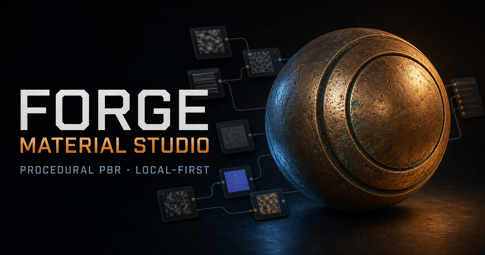
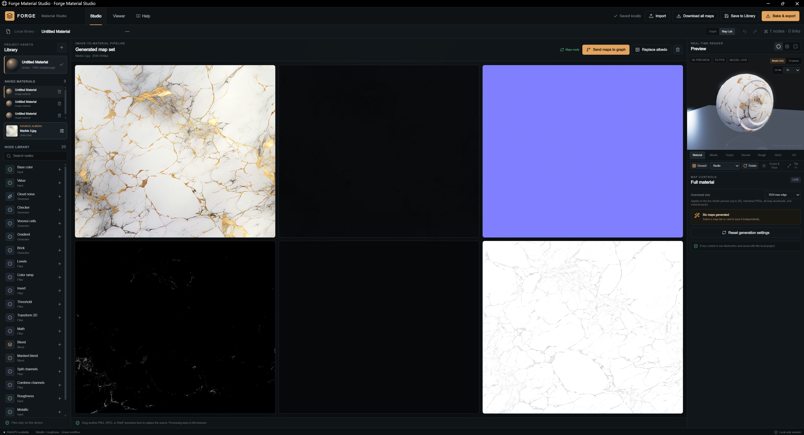
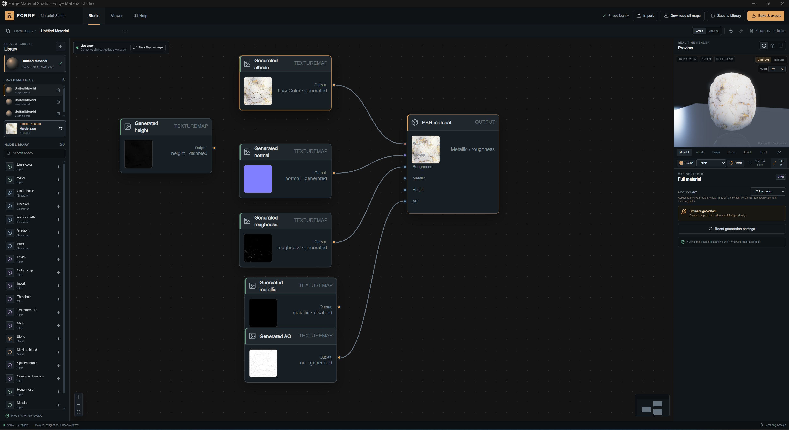
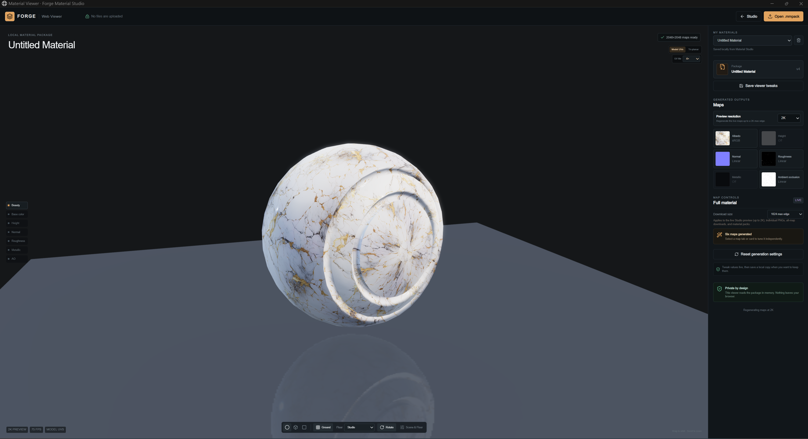

# Forge Material Studio

<p align="center">
  
</p>

Forge Material Studio is a local-first procedural PBR material authoring tool. Build materials with a typed node graph, generate a six-map PBR set from an image, inspect the result in a live Babylon.js preview, and export portable `.mmpack` packages—all without uploading source images or projects.

The application runs on your own computer. It has no account system, telemetry, material upload service, D1 database, or R2 bucket.

## Download and try it

This repository currently ships as source rather than a hosted service or prebuilt installer.

1. Select **Code → Download ZIP** on GitHub and extract the folder.
2. Install [Node.js 22.13 or newer](https://nodejs.org/).
3. Open a terminal in the extracted folder and run:

```bash
npm install
npm run dev
```

Open `http://localhost:3000` for the studio or `http://localhost:3000/viewer` for the package viewer. Everything remains on the local device.

## What you can do

- Build tileable materials with cloud noise, checker, Voronoi, gradient, brick, color-ramp, threshold, transform, math, blend, masked-blend, channel, and normal nodes.
- Turn a PNG, JPEG, or WebP albedo into editable base-color, height, normal, roughness, metallic, and ambient-occlusion maps.
- Preview materials on a sphere, cube, plane, or production-style model with beauty and individual-channel inspection.
- Work at 512, 1024, or 2048 pixels while preserving the source aspect ratio.
- Save projects in IndexedDB with recovery, generated-map caching, undo/redo, and keyboard save shortcuts.
- Export individual PNG maps or a validated `.mmpack` containing baked maps, the source graph, manifest, and export report.
- Open `.mmpack` files in the standalone viewer entirely in browser memory.

## Screenshots

### Image-to-material Map Lab



### Procedural node graph



### Local package viewer



## Generate maps from an image

1. Choose **Add albedo texture** in the Library, or select **Map Lab** in the project toolbar.
2. Open a PNG, JPEG, or WebP file. Forge generates an editable six-map material set in the browser.
3. Select a map card or preview channel to tune it independently. Metallic defaults to a dielectric value because metal cannot be identified reliably from color alone.
4. Choose **Send maps to graph** to continue procedurally, download individual PNGs, or select **Bake & export** to create an `.mmpack`.

## Windows launcher

The local Windows launcher installs dependencies, creates an optimized build when project files change, and opens Forge in a dedicated browser window. Closing that window also stops the local service.

`Material Maker.exe` is intentionally excluded from source control, so it is not included in GitHub's source ZIP. To build it locally, install the .NET 8 SDK and run:

```powershell
powershell -ExecutionPolicy Bypass -File .\launcher\build-launcher.ps1
```

Keep the generated `Material Maker.exe` in the project root.

## Development and validation

```bash
npm install
npm run lint
npm test
npx tsc --noEmit
```

## License

No open-source license has been selected yet. Until one is added, the repository's source remains protected by its owner's default copyright rights.
